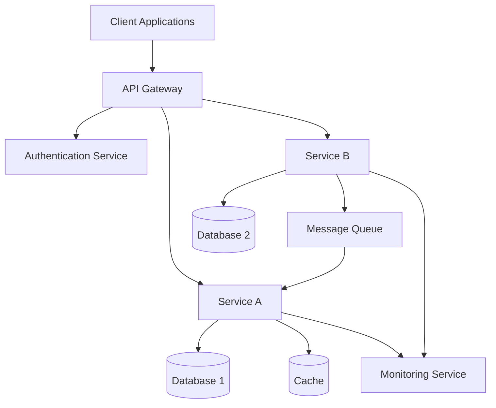

# Architecture Overview

Below is a Mermaid diagram illustrating the high-level architecture overview:

This diagram provides a top-level overview of how components interact in the system:

- **Client Applications** communicate with the system via the **API Gateway**.
- The **API Gateway** routes requests to various services and handles authentication via the **Authentication Service**.
- **Service A** and **Service B** are core microservices, each with their own data stores.
- Shared resources include **Cache** for fast data access, and **Message Queue** for asynchronous processing.
- **Monitoring Service** collects metrics from the microservices for observability.

Feel free to modify or expand the diagram to suit your specific architecture!